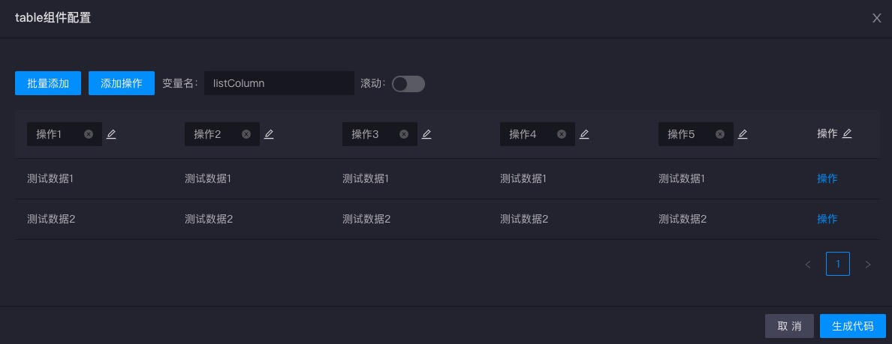
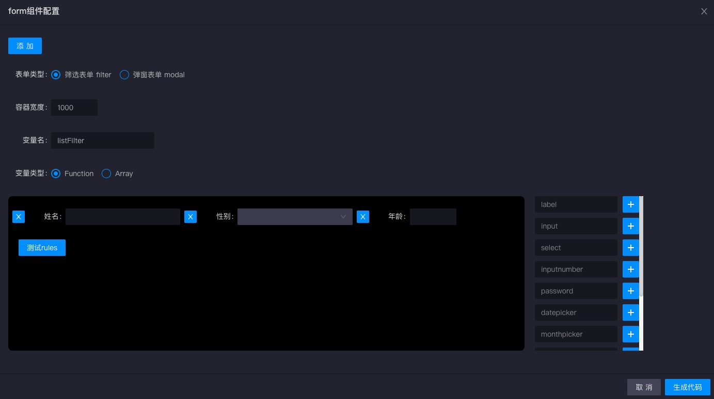
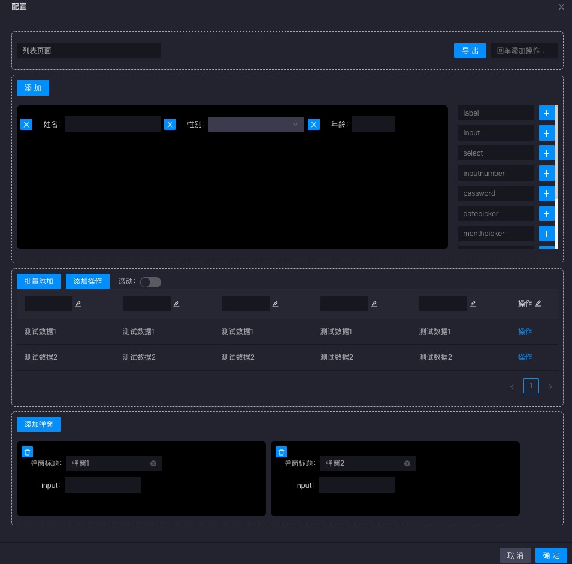

# 代码块

代码块提供更加直观、可视化去自由得配置table、form配置对象，并且完成之后直接导出进所选的文件路径，尾部追加代码。

## *table*

table组件配置可以生成antd中Table组件的`columns`对象

提供的功能：

1. 批量添加： 快速添加表格列
2. 添加操作： 右侧操作列表，支持链接、按钮
3. 自定义变量名： 导出的变量名
4. Column自定义配置

## *form*

form组件配置需要配合封装过的表单组件，生成配置对象

提供的功能：

1. 添加自定义的Form.Item，支持绝大多数属性，并且可配置rules
2. 选择表单类型： 筛选表单/弹窗表单
3. 选择容器宽度
4. 自定义变量名： 导出的变量名
5. 选择导出的变量类型

## list page

list page生成是一个定制化的中后台列表页面。包含标题、操作按钮、筛选表单、表格、弹窗等元素。

提供的功能：

1. 页面标题
2. 页面操作按钮（回车添加）
3. 自定义筛选表单
4. 自定义表格
5. 自定义弹窗（支持弹窗打开/关闭事件与页面操作按钮、table操作按钮关联）
6. 页面命名
7. model namespace

配置完成之后会在导出的文件夹中生成`index.js` `model.js` `map.js`，可直接配置路由访问

