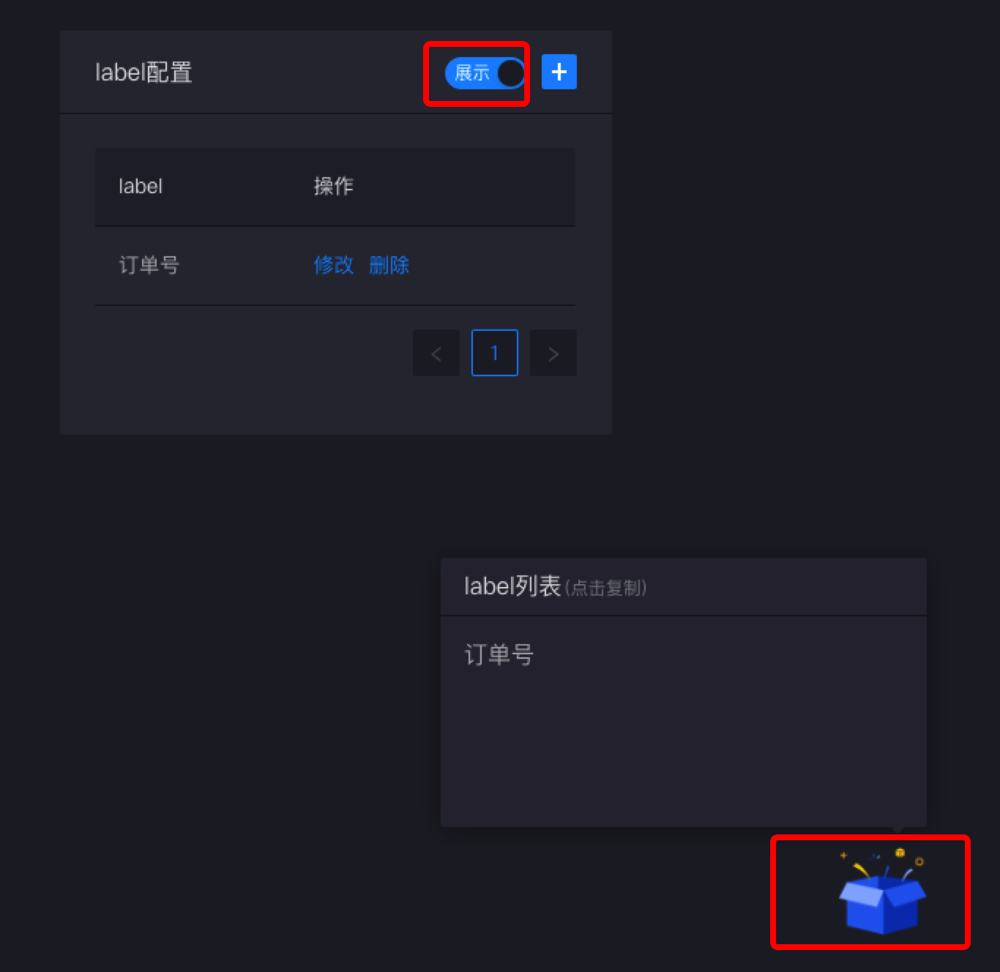

# 配置

## label配置

label配置可以对一些常用的label进行管理，保存常用label然后可以快速选用

提供的功能：

1. 增删改查label
2. 展示label
3. 点击label复制



在配置页面，点击选择label展示，页面全局右下角会出现盒子图标，点击盒子就会出现配置的label列表，点击复制，快速选取label，方便操作。


同时在label输入框中，也可以快速下拉选择

因为没有数据库，label列表的增删改查都是操作缓存文件的，处于`node_modules/.cache/crui/label.json`

```json
{
  display: true,
  list: [
    {
      name: '订单号',
      id: 'xxxx'
    }
  ]
}
```