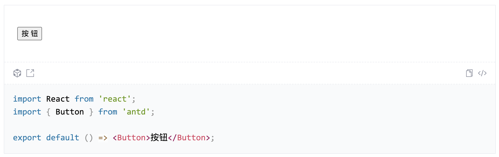
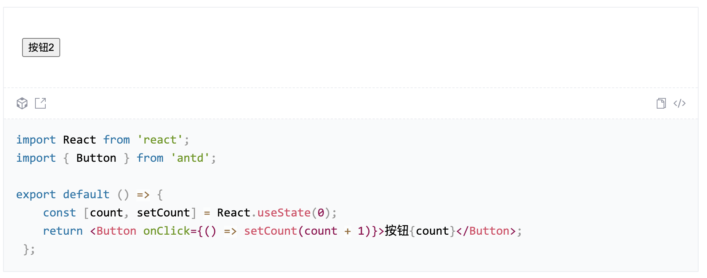
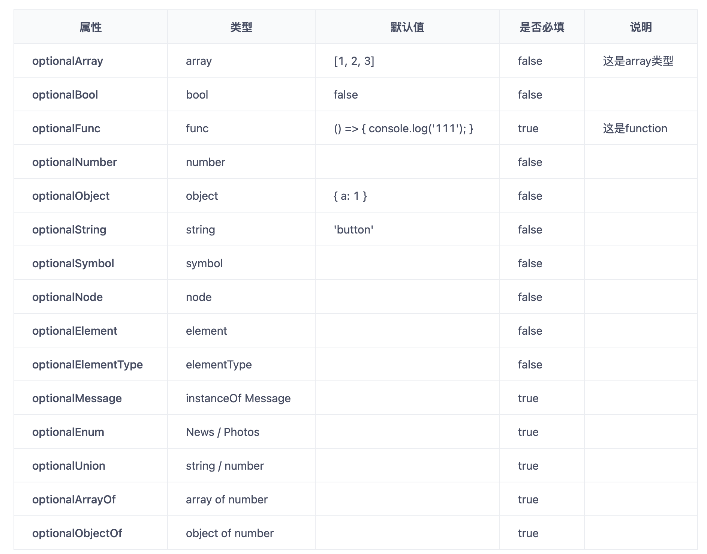

# 文档生成

文档生成的主要代码逻辑来自于[vtmd](https://github.com/rywaroy/vtmd)，当然阉割了大部分功能(主要是太鸡肋了)。该功能主要针对于组件文件，可以根据组件的注释、props、defaulProps等生成介绍文档，配合dumi使用

提供的功能：

1. 选择构建目录（entry）和 输出目录（output）
2. 遍历构建目录下所有的*.(j|t)sx?文件，生成md文档到输出目录
3. 采用socket，展示文档构建是否成功（非组件文件会提示）
4. 支持自定义编写组件例子，配合dumi展示

## 规则

### 注释规则

首先会获取解析组件文件中头部的注释内容

```js
// 这段注释内容
// 这段注释内容

class TestComponent extends Component {
  constructor(props) {
    super(props);
    this.state = {  }
  }
  render() { 
    return (
      <div>test</div>
    );
  }
}

export default TestComponent;
```

解析规则：

* `@author` - 作者
* `@url` - 地址
* `@title` - 标题
* `@example` - 例子

生成：

```md
# 组件 

作者: zzh

地址: www.url.com

一段文本一段文本一段文本一段文本
```

在代码中，块级注释和行级注释是等同的

```js
/**
 * @title 组件
 * @author zzh
 * @url www.url.com
 * 一段文本一段文本一段文本一段文本
 */
```

等同于

```js
// @intro 这是介绍
// @author zzh
// @url www.url.com
// 文本
```

### 组件示例代码

@example 注释后的代码会作为展示代码

```js
/**
 * @example
 * <Button>按钮</Button>
 * /
```
会在md文件中生成代码，配合dumi展示

```jsx
import React from 'react'
import { Button } from 'antd'; // 路径自动生成

export default () => <Button>按钮</Button>;
```



同样也可以返回函数，附带逻辑功能

```js
/**
 * @example
 * () => {
 *    const [count, setCount] = React.useState(0);
 *    return <Button onClick={() => setCount(count + 1)}>按钮{count}</Button>;
 * }
 * /
```

生成

```jsx
import React from 'react';
import { Button } from 'antd'; // 路径自动生成
    
export default () => {
  const [count, setCount] = React.useState(0);
  return <Button onClick={() => setCount(count + 1)}>按钮{count}</Button>;
};
```



### props

针对于props会获取导出的类组件的`propTypes` 和 `defaultProps`

```js
Button.propTypes = {
    // 这是array类型
    optionalArray: PropTypes.array,
    optionalBool: PropTypes.bool,

    /** 这是function */
    optionalFunc: PropTypes.func.isRequired,
    optionalNumber: PropTypes.number,
    optionalObject: PropTypes.object,
    optionalString: PropTypes.string,
    optionalSymbol: PropTypes.symbol,
  	optionalNode: PropTypes.node,
  	optionalElement: PropTypes.element,
  	optionalElementType: PropTypes.elementType,
    optionalMessage: PropTypes.instanceOf(Message).isRequired,
    optionalEnum: PropTypes.oneOf(['News', 'Photos']).isRequired,
    optionalUnion: PropTypes.oneOfType([
        PropTypes.string,
        PropTypes.number,
    ]).isRequired,
    optionalArrayOf: PropTypes.arrayOf(PropTypes.number).isRequired,
    optionalObjectOf: PropTypes.objectOf(PropTypes.number).isRequired,
};
Button.defaultProps = {
    optionalString: 'button',
    optionalArray: [1, 2, 3],
    optionalBool: false,
    optionalObject: { a: 1 },
    optionalFunc: () => { console.log('111'); },
};
```

通过`propTypes`来获取

1. 属性名
2. 类型
3. 是否必填 `true` 、 `false`
4. 说明(类型上方注释)

通过`defaultProps`来获取

1. 默认值

最后生成



### 文件名

生成的md文件名首先会根据组件注释是否存在`@title`，如果不存在则使用组件的变量名。如果出现文件名重复，则会自动在文件名后面带上`(1)` `(2)` `(3)`等数字除重。
