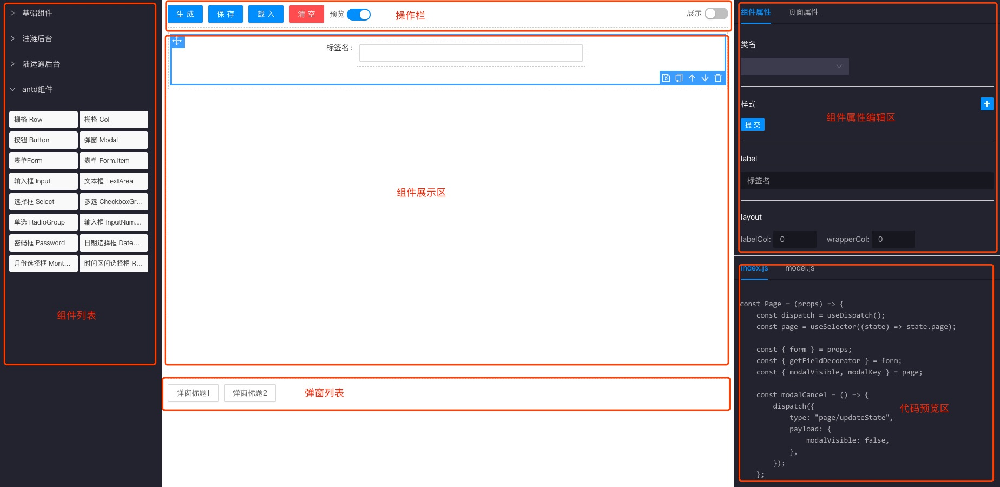
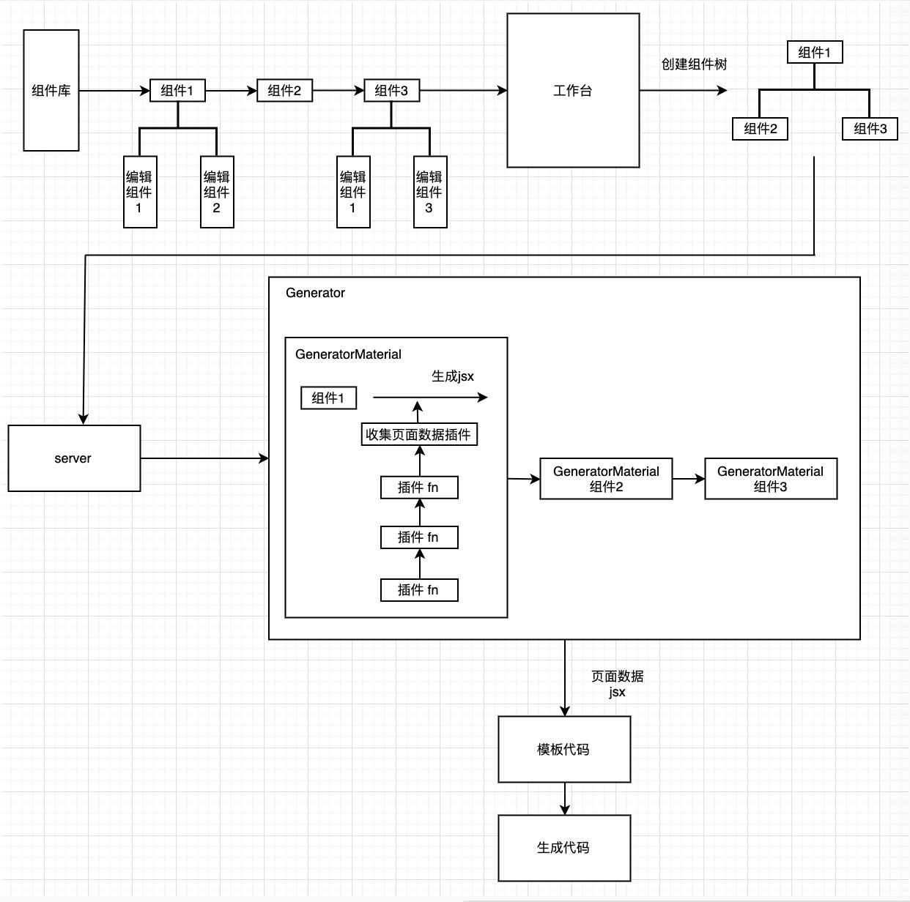

# 可视化搭建

可视化搭建是在“代码块”模块上，添加拖拽功能，更加自由地去搭建页面，生成基础代码。



提供的功能：

1. 物料组件点击、拖拽添加
2. 物料组件保存、复制、上下移动、删除
3. 物料组件属性自定义编辑
4. 页面保存、载入
5. 页面代码生成、预览（先设置好页面基础属性）

## 如何自定义一个物料组件

系统的流程图



这里可以看到写一个自定义物料组件，并且带有自身业务需要`展示组件` `编辑组件` `插件`

展示组件用来在工作台中显示组件内容，编辑组件用来修改组件的props，达到自定义属性的效果，插件用来进行一些自定义操作，生成自己想要的业务代码。

*展示组件*

展示组件对象包含了一些基本的组件信息，例如组件名、标签等等


```js
export interface IMaterial {
  /**组件名 */
  name: string;

  /**标签 */
  tag: string;

  /**import from */
  from: string;

  /**component function */
  component: any;

  /**简介 */
  intro: string;

  /**props */
  props: any;

  /**默认props 只做展示使用 */
  defaultProps?: any;

  /**额外props 组件单独处理使用 */
  extraProps?: any;

  /**编辑组件map */
  editComponents: IEditComponents[];
  id: number;

  /**父级id */
  pid?: number;

  /**是否激活 */
  active?: boolean;

  /**子组件 */
  children?: IMaterial[];

  /**来源项目 */
  project?: string;

  /**是否能加入子组件 */
  haveChildren: boolean;

  haveWrap?: boolean;

  /**幽灵属性 */
  ghost?: boolean;

  /**额外信息 */
  ext?: {
    /**组件类型 */
    type?: string;

    /**代码逻辑 */
    code?: {
      'model.js'?: IModelOption;
      [file: string]: string[] | IComponentOption | IModelOption;
    }

    /**额外代码逻辑 */
    extraCode?: {
      [file: string]: string[] | IComponentOption | IModelOption;
    }
  };
}
```

*编辑组件*

编辑组件props传入onChange方法，来修改目标物料组件的props对象

在IMaterial对象中设置`editComponents`属性来配置一个物料组件对应的编辑组件

```js
{
    editComponents: [
        { name: 'className' },
        { name: 'style' },
        { name: 'prop', props: { propName: 'type', propType: 'string' } },
        { name: 'prop', props: { propName: 'children', propType: 'string' } },
    ],
}
```

*插件*

插件针对一些需要额外操作的组件，例如antd v3中Form.Item下组件需要添加高阶组件

```js
/**
 * 处理Form.Item组件
 */
export default function formitem(material: IMaterial) {
    if (material.tag === 'Form.Item') {
        if (material.children) {
            material.children.forEach(child => {
                child.props.getFieldDecorator = material.props.label;
            });
        }
    }
    if (material.props.getFieldDecorator) {
        const name = material.props.getFieldDecorator;
        // 在创建tag开始前
        this.on('before-create-startTag', () => {
            this.jsx += `{getFieldDecorator('${name}')(`;
        });
        // 在创建tag结束后
        this.on('after-create-jsx', () => {
            this.jsx += ')}';
        });
        delete material.props.getFieldDecorator;
    }
}
```

### 例子

假如有个业务组件 MessageButton 点击会提示 message

在业务代码中，我们可能会这么写

```js
import { message } from 'antd';
import { MessageButton } from '@/components';

const Page = () => {
    const tip = () => {
        message.success('提示语')
    }
    return (
        <MessageButton onClick={tip}/>
    )
}
```

解析上面的代码可知，MessageButton 会附带有3块内容

1. `import { message } from 'antd'; import { MessageButton } from '@/components';` import
2. `const tip = () => { message.success('提示语') }` method
3. `<MessageButton onClick={tip} />` jsx

根据这3个内容，可以写出对应的物料组件对象

```js
// MessageButton.js
const MessageButton = () => <button>按钮</button>

// 创建一个物料组件对象
export default MessageButtonMaterial = {
    name: '提示按钮', // 组件名
    tag: 'MessageButton', // 标签
    form: '@/compents', // import from
    props: {
        onClickFS: 'tip',
        message: '提示语'
    }, // 默认props
    editComponents: [
        { name: 'prop', props: { propName: 'message', propType: 'string' } }, // 编辑组件，可以编辑message
    ],
    haveChildren: false, // 是否有子组件
    ext: {
        code: {
            // indxe.js中的逻辑代码
            'index.js': {
                // import
                // 依赖项，这里依赖了antd message 来提示
                importDeclaration: {
                    antd: {
                        export: ['message'],
                    },
                    '@/components': {
                        export: ['MessageButton'],
                    },
                },
                // method
                methods: [
                    `const tip = () => {
                        message.success('{{message}}')
                    }`
                ]
            }
        }
    }
}
```

在ext.code对象可以配置对应生成的文件（默认index.js 为主文件）其中message.sucess传入的是`{{message}}`，这里考虑到message是可编辑的，所以写了一个类似vue的模板语法，提供2个作用域，一个是生成代码的构建类`Generator` 和物料组件的props，所以这里能直接使用message变量，对应生成的代码就是 `message.success('提示语')`

在创建jsx过程中，会利用物料组件对象中`tag`和`props`

```jsx
<MessageButton onClick={tip} message={'提示语'}></MessageButton>
```

> 因为function无法直接转成string，这里规定属性名结尾带FS会认为是函数属性，onClickFS 会处理成 onClick

jsx中message其实是无用的，只作为储存自定义message使用，所以可以写一个插件来删除

```js
export default function MessageButtonPlugin(material) {
    if (material.tag === 'MessageButton') {
        delete material.props.message;
    }
}
```