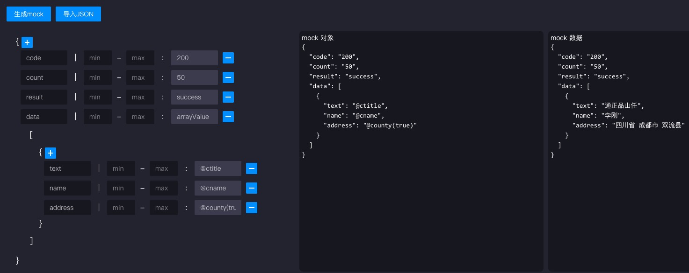
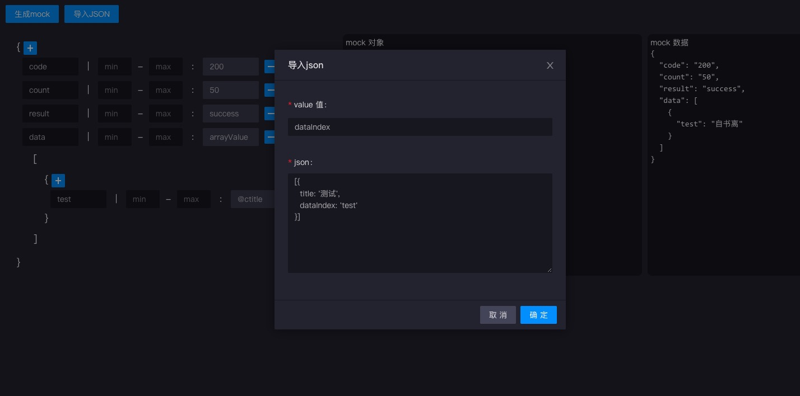
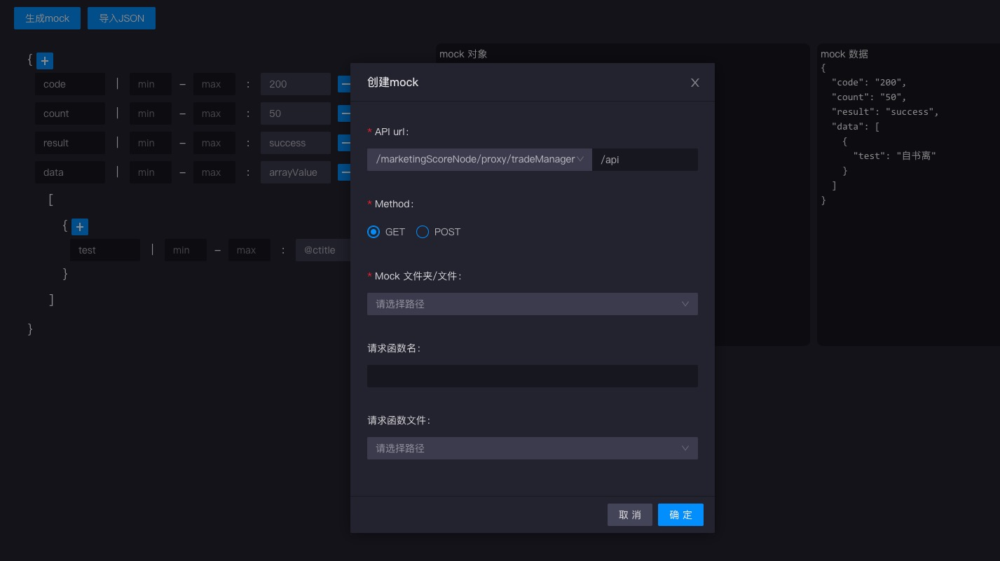
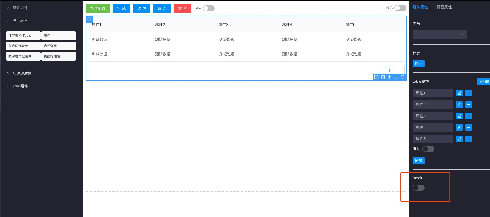

# mock数据

基于mockjs，自动生成mock对象

提供的功能：

1. 自定义操作，添加mock对象属性，支持对象、数组
2. 导入json，直接生成mock对象（自定义主键）
3. 支持mock对象、mock数据的同步展示

## 导入json

添加json解析，可以配置主键，以主键为key生成mock对象，简便操作，可以配合table的columns对象使用

## 生成js

可设置

1. api
2. method
3. mock文件夹/文件（选择文件夹还需设置文件，可生成对应文件）
4. 如果需要services方法，还可以设置请求方法及请求方法及请求函数名

## 扩展功能

在可视化搭建中，table组件添加了mock可选配置，启用mock功能会根据table所配置的columns对象中dataIndex属性来自动生成mock对象。默认生成在mock/api.js中。