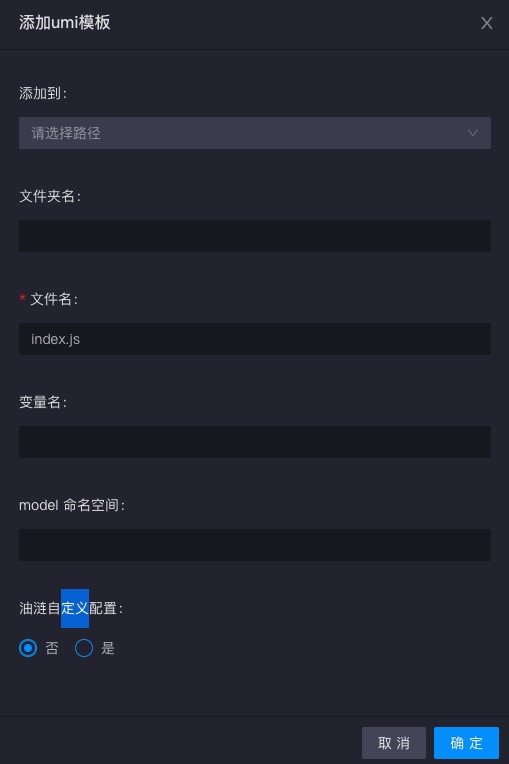
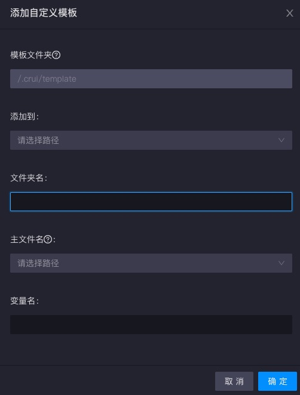

# 模板

*react模板*

点击打开react模板配置弹窗

* 路径: 创建文件后添加到的路径
* 文件夹名: 设置了文件夹名会在当前选择的路径在再创建一层文件夹
* 文件名: 创建文件后的命名，默认index.js
* 变量名: 组件的变量名，默认Template

*umi模板*

umi模板在react模板的基础上多了

* model命名空间: model的namespace
* 油涟自定义配置: 为油涟项目添加的一些代码块

同时也会多生成一个`model.js`

*自定义模板*

自定义模板需要在项目根目录下创建.crui/template文件夹，且该文件夹下存在模板文件，否则无法打开配置弹窗

自定义模板会将模板文件夹下的所有文件复制到选择的路径，与其他模板不同，多了一个

* 主文件名: 获取的是.crui/template文件列表，一般选取的是组件入口文件，选择了主文件，会将配置好的变量名替换导出的组件名

